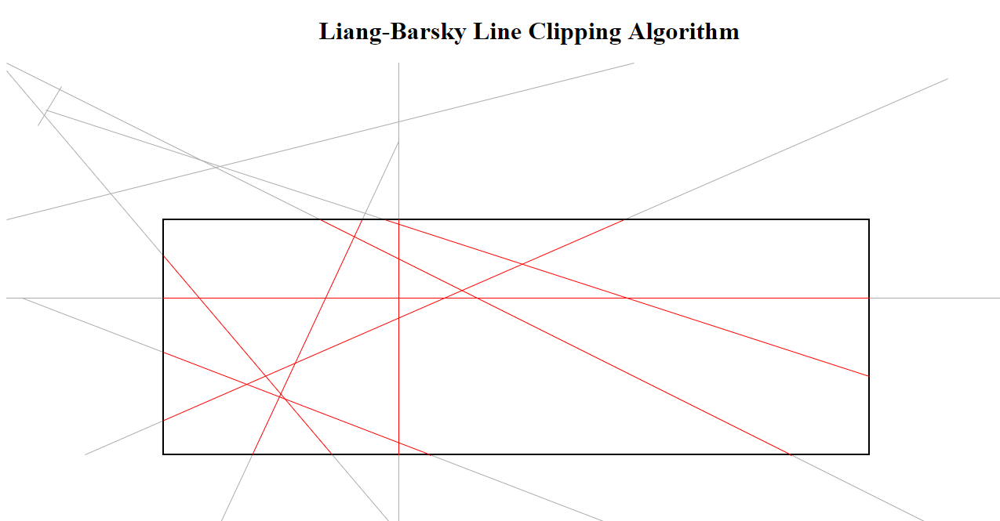

<h1> Liang Barksy Line Clipping Algorithm. </h1>

<h3> 2D Viewing Demonstration. </h3>

 The rectangular box represents the clipping window. Only the lines which lie inside the clipping window are accepted(red colored), while lines lying outside the clipping winodw are clipped i.e. greyed out.

